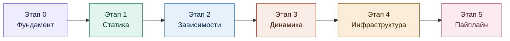
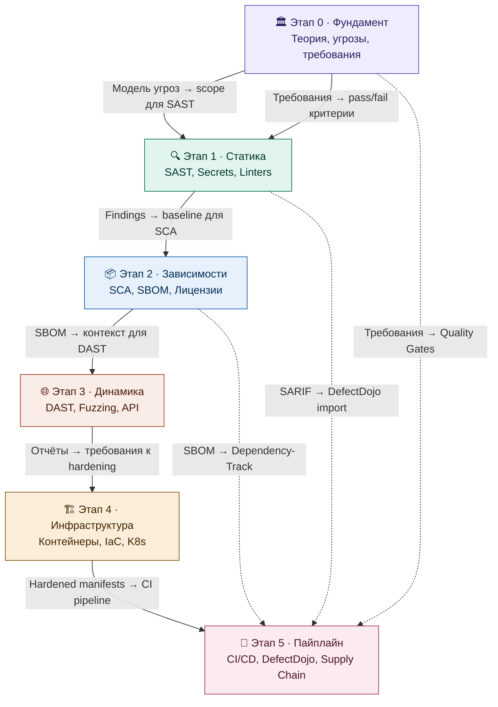

# Маршрут обучения

Визуальная карта курса: этапы, инструменты, мишени, процессы ГОСТа.

---

## Обзор пайплайна

## Зависимости между этапами

---

## Этапы курса

### :material-foundation: Этап 0 · Фундамент

**~12 часов** · Процессы ГОСТа: 5.1, 5.5, 5.6, 5.7 · Мишень: Juice Shop (архитектура)

!!! quote "«Сначала пойми что защищаем и от чего»"

| Модуль | Что делаем | Результат |
|--------|-----------|-----------|
| 0.1 ГОСТ | 25 процессов → 5 блоков, мнемоника, квиз | Маппинг + шпаргалка |
| 0.2 Угрозы | DFD + STRIDE для Juice Shop | Модель угроз |
| 0.3 Требования | Security requirements с pass/fail | Definition of Done |

**Инструменты:** pytm, draw.io

[:material-arrow-right: Перейти к этапу](../stage-0/README.md){ .md-button }

### :material-magnify: Этап 1 · Код под микроскопом

**~10 часов** · Процессы ГОСТа: 5.8, 5.9, 5.15 · Мишени: Juice Shop + WrongSecrets

!!! quote "«Ищем баги, не запуская приложение»"

| Модуль | Инструменты | Ключевой навык |
|--------|------------|----------------|
| 1.1 SAST | Semgrep, Bandit, njsscan | Кастомные правила, triage findings |
| 1.2 Secrets | Gitleaks, TruffleHog, detect-secrets | Pre-commit hook, credential verification |
| 1.3 Linters | ESLint, Ruff, hadolint | Coding standard, Dockerfile lint |

[:material-arrow-right: Перейти к этапу](../stage-1-static-analysis/README.md){ .md-button }

### :material-package-variant: Этап 2 · Зависимости

**~10 часов** · Процессы ГОСТа: 5.4, 5.10, 5.23 · Мишень: Juice Shop (npm + Docker)

!!! quote "«Что тянем из интернета и насколько это безопасно»"

| Модуль | Инструменты | Ключевой навык |
|--------|------------|----------------|
| 2.1 SCA | Trivy, Dep-Check, Grype, npm audit | CVE triage, transitive deps |
| 2.2 SBOM | Syft, cdxgen, Dependency-Track | SBOM generation, мониторинг |
| 2.3 Лицензии | Trivy license, ScanCode, license_finder | Policy-as-code |

[:material-arrow-right: Перейти к этапу](../stage-2-dependencies/README.md){ .md-button }

### :material-web: Этап 3 · Атакуем приложение

**~12 часов** · Процессы ГОСТа: 5.11, 5.12, 5.13 · Мишени: Juice Shop + crAPI

!!! quote "«Приложение запущено — бьём снаружи»"

| Модуль | Инструменты | Ключевой навык |
|--------|------------|----------------|
| 3.1 DAST | ZAP, Nuclei, Nikto, Wapiti | Baseline vs full scan, кастомные шаблоны |
| 3.2 Fuzzing | RESTler, Schemathesis, ffuf | Stateful API fuzzing, hidden paths |
| 3.3 API | Postman, Dredd, CATS | OWASP API Top 10, contract testing |

[:material-arrow-right: Перейти к этапу](../stage-3-dynamic-analysis/README.md){ .md-button }

### :material-server-security: Этап 4 · Инфраструктура

**~12 часов** · Процессы ГОСТа: 5.3, 5.4 · Мишени: Juice Shop image + Kubernetes Goat

!!! quote "«Защищаем не только код, но и окружение»"

| Модуль | Инструменты | Ключевой навык |
|--------|------------|----------------|
| 4.1 Container | Trivy, Grype, Dockle, Docker Scout | Hardened Dockerfile, CIS benchmark |
| 4.2 IaC | Checkov, KICS, Trivy config, KubeLinter | Кастомные политики, hardened manifests |
| 4.3 K8s | Kubescape, kube-bench, Falco, Kyverno | Runtime detection, admission control |

[:material-arrow-right: Перейти к этапу](../stage-4-infrastructure/README.md){ .md-button }

### :material-rocket-launch: Этап 5 · Пайплайн

**~12 часов** · Процессы ГОСТа: 5.2, 5.14, 5.16, 5.17

!!! quote "«Всё вместе — от коммита до деплоя»"

| Модуль | Инструменты | Ключевой навык |
|--------|------------|----------------|
| 5.1 CI/CD | GitHub Actions, GitLab CI, pre-commit | Полный workflow, SARIF upload |
| 5.2 DefectDojo | DefectDojo, Dependency-Track | Дедупликация, SLA, дашборд |
| 5.3 Quality Gates | Custom scripts, metrics | Requirements coverage, pass/fail |
| 5.4 Supply Chain | cosign, SLSA | Image signing, provenance |

[:material-arrow-right: Перейти к этапу](../stage-5-pipeline-integration/README.md){ .md-button }

---

## Что вы получите после прохождения

-   :material-certificate-outline:{ .lg .middle } **Практическое портфолио**

    ---

    Git-репозиторий с артефактами всех 6 этапов — модель угроз, отчёты сканеров, SBOM, CI/CD пайплайн

-   :material-shield-check:{ .lg .middle } **Готовность к аудиту ФСТЭК**

    ---

    Полный набор артефактов по ГОСТ Р 56939-2024 с маппингом к 25 процессам стандарта

-   :material-tools:{ .lg .middle } **Владение 30+ инструментами**

    ---

    От Semgrep и Trivy до DefectDojo и cosign — реальный опыт работы с production-инструментами

-   :material-pipe:{ .lg .middle } **Работающий DevSecOps пайплайн**

    ---

    End-to-end pipeline: SAST → SCA → DAST → Container → Quality Gates → Signing

---

## Связь с ГОСТ Р 56939-2024

Полный маппинг 25 процессов → [docs/gost-process-mapping.md](../docs/gost-process-mapping.md)
